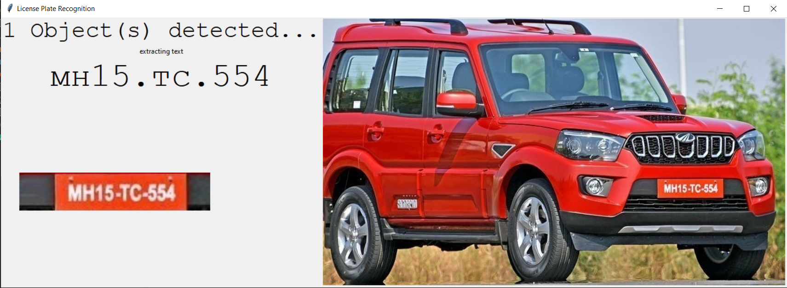

# License Plate Recogniton Using Azure AI Services

## Use Case 1
Store all the traffic violators images in Azure Blob Storage, Create a Blob Trigger and perform inference using trained TensorFlow Model.

This helps in recognition of traffic violators and helps our police, who are busy snapping those violators in phones and then send notifications to corresponding vehicle Number.

## Use Case 2

Vehicles can be easily identified when this system is deployed at a toll gate, so every vehicle passing by is recorded with its registration number associated with a timestamp.

This makes it easy to search for a particular vehicle passed through a toll gate, rather than looking at whole CCTV footage to find a vehicle.

## Tasks Involved

* Object Detection (License Plate)
* Optical Character Recognition 

## Azure AI Services

* <b>Custom Vision</b>

    * Dataset with Object Annotations Required to train your own model and then download model file.
    * In this project, we have downloaded TensorFlow model from Azure Custom Vision service.

* Azure Cognitive Services OCR.

## GUI

* Tkinter Python
### Sample Screenshot

<b>To use directly without GUI, use the predict function to send in the image (using OpenCv) and get the text.</b>

## Future Scope

Use Blob Trigger to perform License Plate Recognition whenever an image uploads to your Blob Storage.

